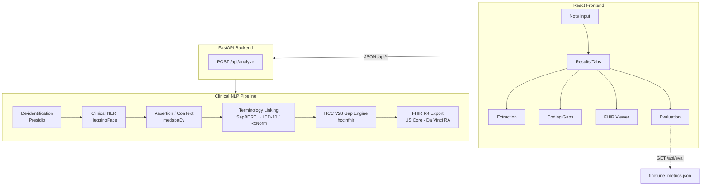

# ChartScope

**Clinical NLP that de-identifies notes, extracts and links entities, detects CMS-HCC V28 coding gaps, and upcycles unstructured notes into FHIR R4.**

ChartScope is a reference implementation and portfolio demo. It closes the loop from raw clinical text to terminology-linked entities, HCC gap recommendations with RAF impact, and a validated FHIR bundle. The app runs on **synthetic and public-domain data only** so anyone can explore it without credentialed datasets.

> **Not for production clinical use.** Gap recommendations are algorithmic and require qualified clinical and coding review.

For a full conceptual walkthrough, see **[ProjectDescription.md](ProjectDescription.md)**.

---

## Quick start

**Prerequisites:** Python 3.11+, Node.js 20+, ~2 GB disk for first-run model downloads.

### 1. Backend

**Windows (PowerShell):**

```powershell
cd backend
python -m venv .venv
.\.venv\Scripts\Activate.ps1
pip install -r requirements.txt
python -m spacy download en_core_web_sm
python -m spacy download en_core_web_lg
.\.venv\Scripts\python.exe -m uvicorn app.main:app --host 127.0.0.1 --port 8001
```

**macOS / Linux:**

```bash
cd backend
python -m venv .venv
source .venv/bin/activate
pip install -r requirements.txt
python -m spacy download en_core_web_sm
python -m spacy download en_core_web_lg
uvicorn app.main:app --host 127.0.0.1 --port 8001
```

Verify: [http://127.0.0.1:8001/api/health](http://127.0.0.1:8001/api/health)

### 2. Frontend

```bash
cd frontend
npm install
npm run dev
```

Open [http://localhost:5173](http://localhost:5173). The header should show a green **Connected** dot.

If the backend is not on port 8000, set the Vite proxy:

```bash
# Windows PowerShell
echo VITE_API_PROXY=http://localhost:8001 > .env.local

# macOS / Linux
echo "VITE_API_PROXY=http://localhost:8001" > .env.local
```

### 3. Try it

Load the **Heart Failure** example, click **Analyze**, and open the **Coding Gaps** tab. You should see a suspected heart-failure HCC with a positive RAF delta.

### Docker (optional)

```bash
docker compose up --build
```

### Tests

```bash
cd backend
pytest tests/ -v
```

---

## Why it matters

Most clinical intelligence lives in unstructured progress notes, while risk adjustment runs on **coded claims**. That mismatch creates two problems: **missed HCCs** that leave legitimate RAF on the table, and **unsupported codes** that create compliance exposure. At the same time, CMS-0057 and Da Vinci push the industry toward **FHIR**-based data exchange.

ChartScope demonstrates one path through that problem: de-identify a note, extract and link clinical entities, compare documentation against claimed ICD-10 codes, score the RAF impact, and export a validated FHIR R4 bundle.

---

## What you get

Four result tabs, one pipeline:

| Tab | Output |
|-----|--------|
| **Extraction** | De-identified note with entity highlights (PROBLEM, MEDICATION, PROCEDURE, TEST, ANATOMY, VITAL), assertion tags (negated / historical / family), ICD-10 and RxNorm links, and a deduplicated key conditions list |
| **Coding Gaps** | CMS-HCC V28 RAF current, potential, and delta; gap cards by status with MEAT evidence and recommendations |
| **FHIR** | Validated R4 collection Bundle (US Core + Da Vinci profiles), collapsible JSON, copy / download |
| **Evaluation** | Fine-tuned PubMedBERT vs. baseline NER: F1 comparison, metrics table, methodology |

### Gap statuses

| Status | Meaning |
|--------|---------|
| **Suspected** | Documented in the note, not on the claim. Captured opportunity. |
| **Confirmed** | Documented and supported by a claimed code. |
| **Unsupported** | On the claim, not found in the note. Compliance risk. |
| **Superseded** | Claim uses a generic code; note supports a more specific diagnosis that upgrades the HCC. |

---

## Architecture



**Monorepo layout:** `backend/` (FastAPI + pipeline) · `frontend/` (React UI) · `backend/eval/` (offline metrics) · `backend/training/` (NER fine-tune track)

| Endpoint | Purpose |
|----------|---------|
| `GET /api/health` | Service health |
| `POST /api/analyze` | Full pipeline on a note + claimed ICD-10 codes |
| `GET /api/examples` | Curated synthetic demo notes |
| `GET /api/mtsamples/random` | Random public MTSamples transcription |
| `GET /api/eval` | Fine-tuned vs. baseline NER metrics |

---

## Model evaluation

Disease NER on the **NCBI-Disease test split** (entity-level strict F1 via [seqeval](https://github.com/chakki-works/seqeval)):

| Model | Precision | Recall | F1 |
|-------|-----------|--------|-----|
| Fine-tuned PubMedBERT (3 epochs) | 0.842 | 0.891 | **0.866** |
| Baseline `d4data/biomedical-ner-all` | 0.512 | 0.291 | 0.371 |
| Advantage | | | **+0.495** |

The baseline is a strong general biomedical NER model with a broader label scheme. Under strict single-type matching on NCBI-Disease, task-specific fine-tuning shows a large measured gain. Live inference still uses the baseline; the fine-tuned weights are not yet wired in.

Training scripts, Colab notebook, and baseline harness: [`backend/training/`](backend/training/)

---

## Data governance

> **Hard rule:** The public app processes **synthetic or public-domain data only**.

Permitted: Synthea, MTSamples, curated synthetic examples, user-pasted demo text.

**Never** commit or deploy **MIMIC**, **n2c2**, or **i2b2** data. Credentialed corpora are for offline training on a local workstation only; only exported weights and eval metrics may enter the repo.

See **[DATA_GOVERNANCE.md](DATA_GOVERNANCE.md)** for full policy.

---

## Tech stack

| Layer | Technologies |
|-------|-------------|
| **Backend** | Python 3.11+, FastAPI, Pydantic v2, uvicorn |
| **De-ID** | Microsoft Presidio (HIPAA Safe Harbor) |
| **NER** | HuggingFace transformers + PyTorch |
| **Clinical context** | spaCy, medspaCy (ConText) |
| **Terminology** | SapBERT + RapidFuzz → ICD-10-CM / RxNorm |
| **Risk adjustment** | [hccinfhir](https://github.com/mimilabs/hccinfhir) (CMS-HCC V28) |
| **Interop** | [fhir.resources](https://github.com/nazrulworld/fhir.resources) R4B |
| **Frontend** | React 18, TypeScript, Vite, Tailwind CSS |
| **Tests** | pytest (33 tests) |

---

## Roadmap

- [ ] Offline fine-tune on credentialed n2c2 / MIMIC annotations (weights only)
- [ ] Relation extraction for richer MEAT evidence
- [ ] Live-pipeline eval harness with Synthea gold fixtures
- [ ] Deployment hardening: model caching, auth boundary

---

## Screenshots

| View | File |
|------|------|
| Coding Gaps | [`screenshots/coding-gaps.png`](screenshots/coding-gaps.png) |
| Entity Extraction | [`screenshots/extraction.png`](screenshots/extraction.png) |
| FHIR Bundle | [`screenshots/fhir-export.png`](screenshots/fhir-export.png) |
| NER Evaluation | [`screenshots/evaluation.png`](screenshots/evaluation.png) |

---

## License

Interview / portfolio project. No warranty of coding accuracy or compliance.
