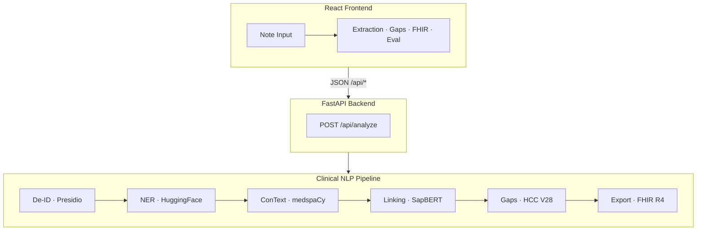

# ChartScope

**Clinical NLP that de-identifies notes, extracts and links clinical entities, detects CMS-HCC V28 risk-adjustment coding gaps, and upcycles unstructured notes into FHIR R4.**

> Portfolio / interview project. Synthetic and public-domain data only. Not for production clinical use.

---

## Why ChartScope

Most clinical intelligence still lives in unstructured progress notes, while risk adjustment and quality programs run on coded claims. That gap creates missed HCC capture on one side and unsupported codes on the other. Payers and providers are also under pressure to exchange data as FHIR under CMS-0057 and Da Vinci.

ChartScope is a working reference implementation that closes the loop: raw note text in, terminology-linked entities, HCC gap recommendations with RAF impact, and a validated FHIR bundle out. Reviewers can run the full pipeline without credentialed datasets.

For a deeper walkthrough of the problem, pipeline, and design decisions, see **[ProjectDescription.md](ProjectDescription.md)**.

---

## Features

- **De-identification** with Microsoft Presidio (HIPAA Safe Harbor) before any downstream NLP
- **Clinical NER** for problems, medications, procedures, tests, anatomy, and vitals
- **Assertion detection** (negation, history, family history) via medspaCy ConText
- **Terminology linking** to ICD-10-CM (SapBERT + lexical match) and RxNorm
- **HCC V28 gap engine** with four statuses: suspected, confirmed, unsupported, superseded
- **RAF scoring** (current, potential, delta) via hccinfhir
- **FHIR R4 export** as a validated US Core / Da Vinci collection Bundle
- **NER evaluation dashboard** comparing fine-tuned PubMedBERT vs. baseline on NCBI-Disease

---

## Architecture



**Monorepo:** `backend/` (FastAPI + pipeline) · `frontend/` (React UI) · `backend/eval/` (metrics) · `backend/training/` (NER fine-tune track)

---

## Quick Start

### Prerequisites

- Python 3.11+
- Node.js 20+
- ~2 GB disk for first-run model downloads (SapBERT, NER, Presidio)

### Backend

**Windows (PowerShell):**

```powershell
cd backend
python -m venv .venv
.\.venv\Scripts\Activate.ps1
pip install -r requirements.txt
python -m spacy download en_core_web_sm
python -m spacy download en_core_web_lg
.\.venv\Scripts\python.exe -m uvicorn app.main:app --host 127.0.0.1 --port 8001
```

**macOS / Linux:**

```bash
cd backend
python -m venv .venv
source .venv/bin/activate
pip install -r requirements.txt
python -m spacy download en_core_web_sm
python -m spacy download en_core_web_lg
uvicorn app.main:app --host 127.0.0.1 --port 8001
```

Health check: [http://127.0.0.1:8001/api/health](http://127.0.0.1:8001/api/health)

Use port `8001` if `8000` is taken. Point the frontend proxy at the same port (below).

### Frontend

```bash
cd frontend
npm install
npm run dev
```

If the backend is not on port 8000, create `.env.local`:

```bash
# Windows PowerShell
echo VITE_API_PROXY=http://localhost:8001 > .env.local

# macOS / Linux
echo "VITE_API_PROXY=http://localhost:8001" > .env.local
```

Open [http://localhost:5173](http://localhost:5173). The header should show a green **Connected** status.

### Docker (optional)

```bash
docker compose up --build
```

Backend on port 8000, frontend on 5173. No `.env.local` needed.

---

## Demo Walkthrough

1. Open the app and load the **Heart Failure** example note.
2. Click **Analyze**.
3. Open the **Coding Gaps** tab (opens automatically).
4. Confirm a **suspected** heart-failure HCC with a positive **RAF delta**.

Other built-in examples demonstrate diabetes complications and COPD exacerbation with deliberately incomplete claimed codes.

---

## API

| Endpoint | Method | Description |
|----------|--------|-------------|
| `/api/health` | GET | Service health |
| `/api/analyze` | POST | Full pipeline on a note + claimed ICD-10 codes |
| `/api/examples` | GET | Curated synthetic demo notes |
| `/api/mtsamples/random` | GET | Random public MTSamples transcription |
| `/api/mtsamples/specialties` | GET | MTSamples specialty list |
| `/api/eval` | GET | Fine-tuned vs. baseline NER metrics |

**Analyze request:**

```json
{
  "note_text": "Clinical note text…",
  "claimed_codes": ["I10", "E11.9"]
}
```

---

## Model Evaluation

Disease NER on the **NCBI-Disease test split** (entity-level strict F1):

| Model | Precision | Recall | F1 |
|-------|-----------|--------|-----|
| Fine-tuned PubMedBERT (3 epochs) | 0.842 | 0.891 | **0.866** |
| Baseline (`d4data/biomedical-ner-all`) | 0.512 | 0.291 | 0.371 |

The baseline uses a broader multi-type label scheme and is penalized under strict single-type matching on NCBI-Disease. Task-specific fine-tuning is the point. Live inference still uses the baseline; see `backend/training/` for the fine-tune track and Colab notebook.

---

## Testing

```bash
cd backend
pytest tests/ -v
```

33 tests cover de-identification, NER, linking, HCC gaps, FHIR export, and data loaders.

---

## Data Governance

The public app processes **synthetic or public-domain data only**: Synthea, MTSamples, curated synthetic examples, and user-pasted demo text.

**Never** commit or deploy MIMIC, n2c2, or i2b2 data. Those credentialed corpora are for offline training only; only exported weights and eval metrics may enter the repo.

See **[DATA_GOVERNANCE.md](DATA_GOVERNANCE.md)** for the full policy.

---

## Tech Stack

| Layer | Technologies |
|-------|-------------|
| Backend | Python 3.11+, FastAPI, Pydantic v2, uvicorn |
| De-ID | Microsoft Presidio, spaCy |
| NER | HuggingFace transformers, PyTorch |
| Clinical context | medspaCy (ConText, Sectionizer) |
| Terminology | SapBERT, RapidFuzz, ICD-10 / RxNorm |
| Risk adjustment | [hccinfhir](https://github.com/mimilabs/hccinfhir) (CMS-HCC V28) |
| Interop | fhir.resources R4B (US Core, Da Vinci RA) |
| Frontend | React 18, TypeScript, Vite, Tailwind CSS |
| Eval / training | datasets, seqeval, evaluate, accelerate |

---

## Roadmap

- [ ] Offline fine-tune on credentialed n2c2 / MIMIC annotations (weights only)
- [ ] Relation extraction for richer MEAT evidence
- [ ] Live-pipeline eval harness with Synthea gold fixtures
- [ ] Deployment hardening (model caching, auth boundary)

---

## Disclaimer

Interview / portfolio project. No warranty of coding accuracy or compliance. Always validate gap recommendations with qualified clinical and coding reviewers.

---

## License

Not licensed for production clinical use.
