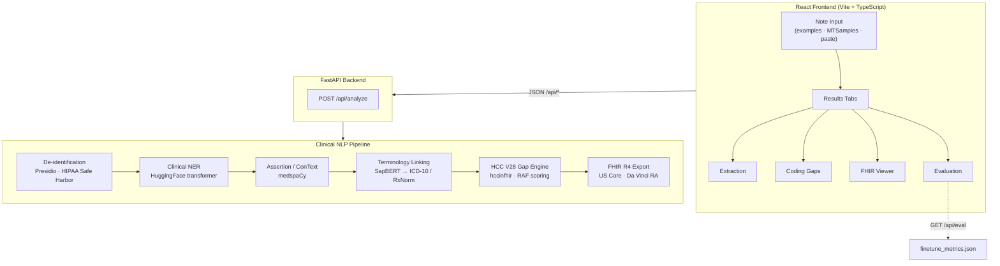

# ChartScope

**Clinical NLP that de-identifies notes, extracts and links clinical entities, detects CMS-HCC V28 risk-adjustment coding gaps, and upcycles unstructured notes into FHIR R4.**

---

## Why it matters

Most clinical intelligence still lives in unstructured progress notes, while risk adjustment and quality programs run on **coded claims**. That gap creates two expensive problems: **missed or under-supported HCCs** that leave legitimate RAF on the table, and **unsupported codes** that create compliance exposure. Payers and providers are simultaneously under pressure to improve documentation specificity and to exchange data as **FHIR** under initiatives like **CMS-0057** and Da Vinci. ChartScope is a reference implementation that closes the loop — from raw note text to terminology-linked entities, HCC gap recommendations, and a validated FHIR R4 bundle — using only **synthetic and public-domain data** so reviewers can run it without credentialed datasets.

---

## Architecture



**Monorepo layout:** `backend/` (FastAPI + pipeline) · `frontend/` (React UI) · `backend/eval/` (offline metrics) · `backend/training/` (NER fine-tune track)

| Endpoint | Purpose |
|----------|---------|
| `GET /api/health` | Service health |
| `POST /api/analyze` | Full pipeline on a note + claimed ICD-10 codes |
| `GET /api/examples` | Curated synthetic demo notes |
| `GET /api/mtsamples/random` | Random public MTSamples transcription |
| `GET /api/eval` | Fine-tuned vs baseline NER metrics |

---

## What it does

The analyzer UI is organized into four tabs:

| Tab | What you see |
|-----|----------------|
| **Extraction** | De-identified note with inline entity highlights (PROBLEM, MEDICATION, PROCEDURE, TEST, ANATOMY, VITAL), assertion tags (negated / historical / family), terminology links (ICD-10, RxNorm), and a deduped **key conditions** list |
| **Coding Gaps** | CMS-HCC V28 **RAF current → potential** with delta; gap cards by status — captured opportunity (suspected), specificity upgrade (superseded), compliance risk (unsupported), documented & coded (confirmed) — each with MEAT evidence and recommendations |
| **FHIR** | Validated R4 collection Bundle: resource-type summary chips, collapsible JSON, copy / download — *unstructured note → US Core / Da Vinci profiles* |
| **Evaluation** | PubMedBERT fine-tuned on NCBI-Disease vs `d4data/biomedical-ner-all` baseline: F1 comparison chart, metrics table, methodology |

---

## Model evaluation

Disease NER on the **NCBI-Disease test split** (entity-level strict F1 via [seqeval](https://github.com/chakki-works/seqeval)):

| Model | Precision | Recall | F1 |
|-------|-----------|--------|-----|
| **Fine-tuned PubMedBERT** (`microsoft/BiomedNLP-BiomedBERT-base-uncased-abstract`, 3 epochs) | 0.842 | 0.891 | **0.866** |
| **Baseline** (`d4data/biomedical-ner-all`) | 0.512 | 0.291 | 0.371 |
| **Advantage** | — | — | **+0.495** |

> **Methodology note:** The baseline is a strong general biomedical NER model trained on a **broader multi-type label scheme**. Under strict single-type span matching on NCBI-Disease, it is penalized when its labels don't align 1:1 with the evaluation annotation scheme. Task-specific fine-tuning on the target corpus is the point — and the measured gain reflects that.

Full training scripts, Colab notebook, and baseline harness: **[`backend/training/`](backend/training/)** · live metrics: **`GET /api/eval`** → [`backend/eval/finetune_metrics.json`](backend/eval/finetune_metrics.json)

---

## Data governance

> **Hard rule:** The public app processes **synthetic or public-domain data only** — Synthea, MTSamples, curated synthetic examples, and user-pasted demo text.

**Never** commit or deploy **MIMIC**, **n2c2**, or **i2b2** data. Those credentialed / DUA-restricted corpora are reserved for **offline model training** on a local workstation; only exported weights and eval metrics may enter the repo.

See **[DATA_GOVERNANCE.md](DATA_GOVERNANCE.md)** for permitted sources, prohibited datasets, and enforcement.

---

## Tech stack

| Layer | Technologies |
|-------|----------------|
| **Backend** | Python 3.11+, FastAPI, Pydantic v2, uvicorn |
| **De-ID** | Microsoft Presidio (HIPAA Safe Harbor identifiers) |
| **NER** | HuggingFace `transformers` + `torch` (`d4data/biomedical-ner-all` inference; PubMedBERT fine-tune track) |
| **Clinical context** | spaCy, medspaCy (ConText — negation, temporality, experiencer) |
| **Terminology** | SapBERT embeddings + RapidFuzz → ICD-10-CM / RxNorm dictionaries |
| **Risk adjustment** | [hccinfhir](https://github.com/mimilabs/hccinfhir) — CMS-HCC Model V28, RAF scoring |
| **Interop** | [fhir.resources](https://github.com/nazrulworld/fhir.resources) R4B — US Core Condition, Da Vinci RiskAssessment |
| **Frontend** | React 18, TypeScript, Vite, Tailwind CSS, axios, lucide-react, recharts |
| **Eval / training** | `datasets`, `seqeval`, `evaluate`, `accelerate` (training track only) |
| **Tests** | pytest (33 tests) |

---

## Run locally

### Prerequisites

- **Python 3.11+**
- **Node.js 20+**
- ~2 GB disk for first-run model downloads (SapBERT, NER, Presidio)

### Backend

**Windows (PowerShell):**

```powershell
cd backend
python -m venv .venv
.\.venv\Scripts\Activate.ps1
pip install -r requirements.txt
python -m spacy download en_core_web_sm
python -m spacy download en_core_web_lg   # Presidio PHI recall

.\.venv\Scripts\python.exe -m uvicorn app.main:app --host 127.0.0.1 --port 8001
```

**macOS / Linux:**

```bash
cd backend
python -m venv .venv
source .venv/bin/activate
pip install -r requirements.txt
python -m spacy download en_core_web_sm
python -m spacy download en_core_web_lg

uvicorn app.main:app --host 127.0.0.1 --port 8001
```

Verify: [http://127.0.0.1:8001/api/health](http://127.0.0.1:8001/api/health)

> **Port note:** Use `8001` (or any free port) if `8000` is occupied. Point the frontend proxy at the same port (below).

**Acceptance demo:** Load the **Heart Failure** example → **Analyze** → Coding Gaps tab should show a suspected heart-failure HCC with a **positive RAF delta**.

### Frontend

**Windows / macOS / Linux:**

```bash
cd frontend
npm install

# If backend is not on port 8000, set the Vite proxy target:
# Windows PowerShell:
#   echo VITE_API_PROXY=http://localhost:8001 > .env.local
# macOS/Linux:
#   echo "VITE_API_PROXY=http://localhost:8001" > .env.local

npm run dev
```

Open the URL Vite prints (default [http://localhost:5173](http://localhost:5173)). The header should show a green **Connected** dot.

### Tests

```bash
cd backend
pytest tests/ -v
```

### Docker (optional)

```bash
docker compose up --build
```

---

## Roadmap

- [ ] **Offline fine-tune** on credentialed n2c2 / MIMIC annotations (weights only in repo)
- [ ] **Relation extraction** — problem–medication and problem–test links for richer MEAT evidence
- [ ] **Live-pipeline eval harness** — gold fixtures from Synthea + gap-detection precision/recall
- [ ] **Deployment** — containerized API, model caching, auth boundary for enterprise pilots

---

## Screenshots

> Placeholder paths — add images before publishing.

| View | File |
|------|------|
| Coding Gaps (RAF delta + HCC cards) | [`screenshots/coding-gaps.png`](screenshots/coding-gaps.png) |
| Entity Extraction (highlights + key conditions) | [`screenshots/extraction.png`](screenshots/extraction.png) |
| FHIR Bundle viewer | [`screenshots/fhir-export.png`](screenshots/fhir-export.png) |
| NER Evaluation dashboard | [`screenshots/evaluation.png`](screenshots/evaluation.png) |

---

## License

Interview / portfolio project — **not for production clinical use**. No warranty of coding accuracy or compliance; always validate with qualified clinical and coding reviewers.
