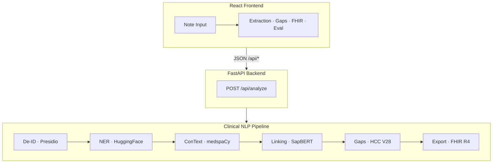

# ChartScope

Clinical NLP that de-identifies notes, extracts and links entities, flags CMS-HCC V28 coding gaps with RAF impact, and turns unstructured text into a validated FHIR R4 bundle.

Uses synthetic and public-domain data only. Not intended for production clinical use.

---

## Why this exists

Most of the useful clinical detail still lives in progress notes. Risk adjustment and billing run on ICD-10 codes, which roll up into Hierarchical Condition Categories (HCCs) and a Risk Adjustment Factor (RAF) that drives Medicare Advantage reimbursement.

When the note and the claim do not match, you get two bad outcomes: missed HCC capture on one side, unsupported codes sitting on the claim on the other. Payers and providers are also being pushed toward FHIR exchange under CMS-0057 and Da Vinci.

ChartScope closes that loop. Paste a note, optionally attach claimed ICD-10 codes, and get back linked entities, gap recommendations with RAF math, and a FHIR bundle you can inspect. It runs on synthetic and public-domain data, no credentialed datasets required.

For a longer walkthrough of the problem, pipeline design, and tradeoffs, see [ProjectDescription.md](ProjectDescription.md).

---

## What you get

- **De-identification** with Microsoft Presidio (HIPAA Safe Harbor) before any downstream NLP
- **Clinical NER** for problems, medications, procedures, tests, anatomy, and vitals
- **Assertion detection** (negation, history, family history) via medspaCy ConText
- **Terminology linking** to ICD-10-CM (SapBERT + lexical match) and RxNorm
- **HCC V28 gap engine** with four statuses: suspected, confirmed, unsupported, superseded
- **RAF scoring** (current, potential, delta) via [hccinfhir](https://github.com/mimilabs/hccinfhir)
- **FHIR R4 export** as a validated US Core / Da Vinci collection Bundle
- **NER evaluation dashboard** comparing fine-tuned PubMedBERT vs. the live baseline on NCBI-Disease

---

## Architecture



**Monorepo layout:** `backend/` (FastAPI + pipeline) · `frontend/` (React UI) · `backend/eval/` (metrics) · `backend/training/` (NER fine-tune track)

De-identification runs first on purpose. PHI gets masked before NER, linking, or anything else touches the text.

---

## Quick start

### Prerequisites

- Python 3.11+
- Node.js 20+
- About 2 GB free disk for first-run model downloads (SapBERT, NER, Presidio)

### Backend

**Windows (PowerShell):**

```powershell
cd backend
python -m venv .venv
.\.venv\Scripts\Activate.ps1
pip install -r requirements.txt
python -m spacy download en_core_web_sm
python -m spacy download en_core_web_lg
.\.venv\Scripts\python.exe -m uvicorn app.main:app --host 127.0.0.1 --port 8001
```

**macOS / Linux:**

```bash
cd backend
python -m venv .venv
source .venv/bin/activate
pip install -r requirements.txt
python -m spacy download en_core_web_sm
python -m spacy download en_core_web_lg
uvicorn app.main:app --host 127.0.0.1 --port 8001
```

Health check: [http://127.0.0.1:8001/api/health](http://127.0.0.1:8001/api/health)

Port 8001 is used here in case 8000 is already taken. Point the frontend proxy at the same port (below).

### Frontend

```bash
cd frontend
npm install
npm run dev
```

If the backend is not on port 8000, create `.env.local`:

```bash
# Windows PowerShell
echo VITE_API_PROXY=http://localhost:8001 > .env.local

# macOS / Linux
echo "VITE_API_PROXY=http://localhost:8001" > .env.local
```

Open [http://localhost:5173](http://localhost:5173). The header should show a green **Connected** status.

### Docker (optional)

```bash
docker compose up --build
```

Backend on port 8000, frontend on 5173. No `.env.local` needed.

---

## Try it in two minutes

1. Open the app and load the **Heart Failure** example note.
2. Click **Analyze**.
3. The **Coding Gaps** tab opens automatically.
4. You should see a **suspected** heart failure HCC with a positive **RAF delta**.

The other built-in examples cover diabetes with complications and a COPD exacerbation. Each one has claimed codes that deliberately under-represent what the note documents.

You can also paste your own demo text or pull a random [MTSamples](https://www.mtsamples.com/) transcription from the note picker.

---

## API

| Endpoint | Method | Description |
|----------|--------|-------------|
| `/api/health` | GET | Service health |
| `/api/analyze` | POST | Full pipeline on a note + claimed ICD-10 codes |
| `/api/examples` | GET | Curated synthetic demo notes |
| `/api/mtsamples/random` | GET | Random public MTSamples transcription |
| `/api/mtsamples/specialties` | GET | MTSamples specialty list |
| `/api/eval` | GET | Fine-tuned vs. baseline NER metrics |

**Analyze request:**

```json
{
  "note_text": "Clinical note text…",
  "claimed_codes": ["I10", "E11.9"]
}
```

**Gap statuses:**

| Status | Meaning |
|--------|---------|
| **suspected** | Documented in the note, missing from the claim |
| **confirmed** | Documented and backed by a claimed code |
| **unsupported** | On the claim, not found in the note |
| **superseded** | Claim has a generic code; the note supports something more specific with a higher HCC |

---

## Model evaluation

Disease NER on the **NCBI-Disease test split** (entity-level strict F1):

| Model | Precision | Recall | F1 |
|-------|-----------|--------|-----|
| Fine-tuned PubMedBERT (3 epochs) | 0.842 | 0.891 | **0.866** |
| Baseline (`d4data/biomedical-ner-all`) | 0.512 | 0.291 | 0.371 |

The baseline uses a broader multi-type label scheme, so it gets penalized under strict single-type matching on NCBI-Disease. That is the point of the comparison: task-specific fine-tuning matters.

Live inference still uses the baseline model. The fine-tune track lives in `backend/training/` with a Colab notebook if you want to reproduce the numbers.

---

## Testing

```bash
cd backend
pytest tests/ -v
```

33 tests cover de-identification, NER, linking, HCC gaps, FHIR export, and data loaders.

---

## Data governance

The public app only processes **synthetic or public-domain data**: Synthea bundles, MTSamples transcriptions, curated synthetic examples, and text you paste into the UI yourself.

Do not commit or deploy MIMIC, n2c2, or i2b2 data. Those credentialed corpora are for offline training only. Only exported weights and eval metrics belong in this repo.

See [DATA_GOVERNANCE.md](DATA_GOVERNANCE.md) for the full policy.

---

## Tech stack

| Layer | Technologies |
|-------|-------------|
| Backend | Python 3.11+, FastAPI, Pydantic v2, uvicorn |
| De-ID | Microsoft Presidio, spaCy |
| NER | HuggingFace transformers, PyTorch |
| Clinical context | medspaCy (ConText, Sectionizer) |
| Terminology | SapBERT, RapidFuzz, ICD-10 / RxNorm |
| Risk adjustment | [hccinfhir](https://github.com/mimilabs/hccinfhir) (CMS-HCC V28) |
| Interop | fhir.resources R4B (US Core, Da Vinci RA) |
| Frontend | React 18, TypeScript, Vite, Tailwind CSS |
| Eval / training | datasets, seqeval, evaluate, accelerate |

---

## Roadmap

- [ ] Offline fine-tune on credentialed n2c2 / MIMIC annotations (weights only)
- [ ] Relation extraction for richer MEAT evidence
- [ ] Live-pipeline eval harness with Synthea gold fixtures
- [ ] Deployment hardening (model caching, auth boundary)

---

## Disclaimer

No warranty of coding accuracy or compliance. Gap recommendations are algorithmic outputs. Always validate them with qualified clinical and coding reviewers before acting on them.

Not licensed for production clinical use.
